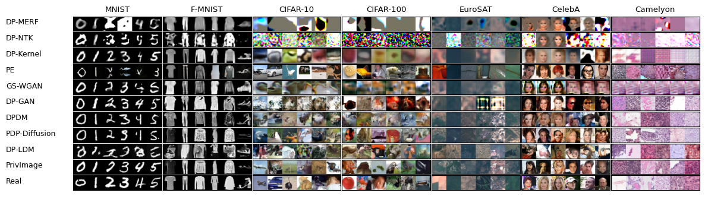

<div align=center>
  
# DPImageBench: A Unified Benchmark for Differentially Private Image Synthesis Algorithms
</div>

DPImageBench is an open-source toolkit developed to facilitate the research and application of DP image synthesis. DPImageBench simplifies the access, understanding, and assessment of DP image synthesis, making it accessible to both researchers and the broader community. The strengths of DPImageBench are presented as follows. 

(1) **Methods**: DPImageBench studies eleven prominent methods and systematically characterize each based on model architecture, pretraining strategy, and privacy mechanism. 

(2) **Evaluation**: We include nine datasets, and seven fidelity and utility metrics to thoroughly assess these methods. Notably, we find that the common practice of selecting downstream classifiers based on the highest accuracy on the sensitive test set not only violates DP but also overestimates the utility scores. DPImageBench corrects for these mistakes. 

(3) **Platform**: Despite the wide variety of methods and evaluation protocols, DPImageBench provides a standardized interface that accommodates all current and future implementations within a unified framework.

<div align=center>

</div>

<p align="center">Synthetic images by algorithms in DPImageBench with $\epsilon=10$ .</p>

## 1. Contents
  - [1. Contents](#1-contents)
  - [2. Introduction](#2-introduction)
    - [2.1 Currently Supported Algorithms](#21-currently-supported-algorithms)
    - [2.2 Currently Supported Datasets](#22-currently-supported-datasets)
  - [3. Repo Contents](#3-repo-contents)
  - [4. Quick Start](#4-quick-start)
    - [4.1 Install DPImageBench](#41-install-dpimagebench)
    - [4.2 Prepare Dataset](#42-prepare-dataset)
    - [4.3 Running](#43-running)
      - [4.3.1 Key hyper-parameter introductions](#431-key-hyper-parameter-introductions)
      - [4.3.2 How to run](#432-how-to-run)
      - [4.3.3 Training using checkpoints](#433-training-using-checkpoints)
    - [4.4 Results](#44-results)
      - [4.4.1 Results Structure](#441-results-structure)
      - [4.4.2 Results Explanation](#442-results-explanation)
    - [4.5 Results Visualization](#45-results-visualization)
  - [5. Customization](#5-customization)
  - [6. Main Results](#6-main-results)
  - [7. Contacts](#7-contacts)
  - [8. Citation](#8-citation)
  - [Acknowledgment](#acknowledgement)

### Updates 

- 🎉 **(2024.01.23)** We add a new SOTA DP image synthesizer [DP-LORA](https://arxiv.org/abs/2406.01355) to DPImageBench! Please try it out!
- 🎉 **(2024.11.19)** We're thrilled to announce the release of initial version of DPImageBench!

### Todo

- [ ] Structure: unify the output files; add notes

- [x] Privimage automatically edit the semantic selective classifier.


## 2. Introduction

### 2.1 Currently Supported Algorithms

We list currently supported DP image synthesis methods as follows.

  | Methods |  Link                                                         |
  | -------------- | ------------------------------------------------------------ |
  | DP-MERF            |  [\[AISTATS 2021\] DP-MERF: Differentially Private Mean Embeddings With Randomfeatures for Practical Privacy-Preserving Data Generation](https://proceedings.mlr.press/v130/harder21a.html) |
  | DP-NTK            |  [\[AISTATS 2021\] Differentially Private Neural Tangent Kernels (DP-NTK) for Privacy-Preserving Data Generation](https://arxiv.org/html/2303.01687v2) |
  | DP-Kernel        |  [\[NeuriPS 2023\] Functional Renyi Differential Privacy for Generative Modeling](https://proceedings.neurips.cc/paper_files/paper/2023/hash/2f9ee101e35b890d9eae79ee27bcd69a-Abstract-Conference.html) |
  | PE          |  [\[ICLR 2024\] Differentially Private Synthetic Data via Foundation Model {API}s 1: Images](https://openreview.net/forum?id=YEhQs8POIo) |
  | GS-WGAN            |  [\[NeuriPS 2020\] GS-WGAN: A Gradient-Sanitized Approach for Learning Differentially Private Generators](https://arxiv.org/pdf/2006.08265) |
  | DP-GAN            |  [\[arXiv 2020\] Differentially Private Generative Adversarial Network (arxiv.org)](https://arxiv.org/abs/1802.06739) |
  | DPDM          |  [\[TMLR 2023\] Differentially Private Diffusion Models](https://openreview.net/forum?id=ZPpQk7FJXF) |
  | PDP-Diffusion       | [\[2302.13861\] Differentially Private Diffusion Models Generate Useful Synthetic Images (arxiv.org)](https://arxiv.org/abs/2302.13861) |
  | DP-LDM            | [\[TMLR 2024\] Differentially Private Latent Diffusion Models](https://arxiv.org/abs/2305.15759) |
  | DP-LoRA           | [\[arXiv 2024\] Differentially Private Fine-Tuning of Diffusion Models](https://arxiv.org/abs/2406.01355) |
  | PrivImage       | [\[UESNIX Security 2024\] PrivImage: Differentially Private Synthetic Image Generation using Diffusion Models with Semantic-Aware Pretraining](https://www.usenix.org/conference/usenixsecurity24/presentation/li-kecen) |

### 2.2 Currently Supported Datasets
We list the studied datasets as follows, which include seven sensitive datasets and two public datasets.
  | Usage |  Dataset  |
  | ------- | --------------------- |
  | Pretraining dataset | ImageNet_ILSVRC2012, Places365 |
  | Sensitive dataset | MNIST, FashionMNIST, CIFAR-10, CIFAR-100, EuroSAT, CelebA, Camelyon |

## 3. Repo Contents

Below is the directory structure of the DPImageBench project, which organizes its two core functionalities within the `models/` and `evaluation/` directories. To enhance user understanding and showcase the toolkit's ease of use, we offer a variety of example scripts located in the `scripts/` directory.


```plaintext
DPImageBench/
├── config/                     # Configuration files for various DP image synthesis algorithms
│   ├── DP-MERF      
│   ├── DP-NTK       
│   ├── DP-Kernel
│   ├── PE            
│   ├── DP-GAN         
│   ├── DPDM        
│   ├── PDP-Diffusion      
│   ├── DP-LDM-SD
│   ├── DP-LDM
│   ├── GS-WGAN
│   └── PDP-Diffusion   
├── data/                       # Data Preparation for Our Benchmark
│   ├── stylegan3
│   ├── SpecificPlaces365.py
│   ├── dataset_loader.py
│   └── preprocess_dataset.py 
├── dataset/                    # Datasets studied in the project
├── docker/                     # Docker file
├── exp/                        # The output of the training process and evaluation results.
├── evaluation/                 # Evaluation module of DPImageBench, including utility and fidelity
│   ├── classifier/             # Downstream tasks classification training algorithms
│   │   ├── densenet.py  
│   │   ├── resnet.py 
│   │   ├── resnext.py 
│   │   └── wrn.py 
│   ├── ema.py 
│   └── evaluator.py 
├── models/                     # Implementation framework for DP image synthesis algorithms
│   ├── DP_Diffusion      
│   ├── DP_GAN       
│   ├── DP_MERF
│   ├── DP_NTK          
│   ├── GS_WGAN       
│   ├── PE     
│   ├── PrivImage
│   ├── dpsgd_diffusion.py
│   ├── dpsgd_gan.py
│   ├── pretrained_models       # The pre-downloaed files for PE and PrivImage
│   ├── model_loader.py           
│   └── synthesizer.py  
├── opacus/                     # Implementation of DPSGD
├── plot/                       # Figures and plots in our paper
│   ├── plot_eps_change.py                           # Plotting for Figure 5 and 10
│   ├── plot_size_change.py                          # Plotting for Figure 6
│   ├── plot_wo_pretrain_cond_cifar10.py             # Plotting for Figure 7
│   ├── plot_wo_pretrain_cond_fmnist.py              # Plotting for Figure 9
│   ├── plot_wo_pretrain_places_imagenet.py          # Plotting for Figure 8   
│   └── visualization.py                             # Plotting for Figure 4 
├── scripts/                    # Scripts for using DPImageBench
│   ├── diffusion_size_change.py                    
│   ├── download_dataset.sh                          
│   ├── eps_change.sh.                               
│   ├── gan_size_change.sh                           
│   ├── pdp_diffusion.sh                             
│   └── test_classifier.py                                            
├── utils/                      # Helper classes and functions supporting various operations
│   └── utils.py                     
├── README.md                   # Main project documentation
└── requirements.txt            # Dependencies required for the project
```

## 4. Quick Start

### 4.1 Install DPImageBench

Clone repo and setup the environment:

 ```
git clone git@github.com:2019ChenGong/DPImageBench.git
sh install.sh
 ```

We also provide the [Docker](./docker/Dockerfile) file.

### 4.2 Prepare Dataset

 ```
sh scripts/data_preparation.sh
 ```

After running, we can found the folder `dataset`:

  ```plaintext
dataset/                                  
├── camelyon/       
├── celeba/ 
├── cifar10/ 
...
```

### 4.3 Running

The training and evaluatin codes are `run.py` and `eval.py`.

The core codes of `run.py` are present as follows.

```python
def main(config):

    initialize_environment(config)

    model, config = load_model(config)

    sensitive_train_loader, sensitive_val_loader, sensitive_test_loader, public_train_loader, config = load_data(config)

    model.pretrain(public_train_loader, config.pretrain)

    model.train(sensitive_train_loader, config.train)

    syn_data, syn_labels = model.generate(config.gen)

    evaluator = Evaluator(config)
    evaluator.eval(syn_data, syn_labels, sensitive_train_loader, sensitive_val_loader, sensitive_test_loader)
```

#### 4.3.1 Key hyper-parameter introductions

We list the key hyper-parameters below, including their explanations and available options.

- `--data_name`: means the sensitive dataset; the option is [`mnist_28`, `fmnist_28`, `cifar10_32`, `cifar100_32`, `eurosat_32`, `celeba_male_32`, `camelyon_32`].
- `--method`: the method to train the DP image synthesizers; the option is [`DP-NTK`, `DP-Kernel`, `DP-MERF`, `DPGAN`, `DP-LDM-SD`, `DP-LDM`, `DP-LORA`, `DPDM`, `PE`, `GS-WGAN`, `PDP-Diffusion`, `PrivImage`].
- `--epsilon`: the privacy budget 10.0; the option is [`1.0`, `10.0`].
- `--exp_description`: the notes for the name of result folders.
- `setup.n_gpus_per_node`: means the number of GPUs to be used for training.
- `pretrain.cond`: specifies the mode of pretraining. The options are [`true`, `false`], where `true` indicates conditional pretraining and `false` indicates conditional pretraining.
- `public_data.name`: the name of pretraining dataset; the option is [`null`, `imagenet`, `places365`, `emnist`], which mean that without pretraining, using ImageNet dataset as pretraining dataset, and using Places365 as pretraining dataset. It is notice that DPImageBench uses ImageNet as default pretraining dataset. If users use Places365 as pretraining dataset, please add `public_data.n_classes=365 public_data.train_path=dataset/places365`.
- `eval.mode`: the mode of evaluations; the option is [`val`, `syn`] which means that using part of sensitive images and directly using the synthetic images as the validation set for model selection, respectively. The default setting is `val`.
- `setup.master_port`: a configuration parameter specifying the port number on the master node (or primary process) that other processes or nodes use to communicate within a distributed system.
- `pretrain.n_epochs`: the number of epoch for pretraining.
- `train.n_epochs`: the number of epoch for finetuning on sensitive datasets.
- `train.dp.n_split`: the number of gradient accumulations for saving GPU memory usage.

> [!Note]
>
> DP-LDM originally uses a latent diffusion model as the DP synthesizer. For a fair comparison, we now use a standard diffusion model, just like other diffusion-based models, which we call `DP-LDM-SD`. In addition, `DP-LDM` means using latent diffusion models (i.e., stabel diffusion) as synthesizers.

> [!Tip]
>
> Experiments such as pretraining or using DPSGD require significant computational resources, as shown in Table 17 of our paper. We recommend to use 4 NVIDIA GeForce A6000 Ada GPUs and 512GB of memory. Here are some tips to help users efficiently reduce computational resource usage and running time in an appropriate way:
> - Reduce `pretrain.n_epochs` and `train.n_epochs`: Reducing the number of pretraining and fine-tuning steps can decrease running time but may also impact the performance of synthetic images.
> - Increase `train.dp.n_split`: Increasing `train.dp.n_split` enables jobs to run even when GPU memory is insufficient. However, this adjustment will lead to longer running times.
> - Share the pretraing models: Some algorithms can share the same pretrained models, `PDP-Diffusion` and `DP-LDM-SD`, as well as `DP-LoRA and DP-LDM`. Additionally, for certain algorithms, different sensitive datasets can also share the same pretrained model. For detailed instructions on using pretrained synthesizers, please refer to the section "Directly use the pretrained synthesizers" in [4.3.2 How to run](#432-how-to-run). Sharing pretrained models eliminates the need for additional pretraining, helping to save computational resources.


> [!Warning]
>
> It is a common [issue](https://pytorch.org/docs/stable/distributed.html) that we can not run a distributed process under a `setup.master_port=6026`. If you intend to run multiple distributed processes on the same machine, please consider using a different `setup.master_port`, such as 6027.


#### 4.3.2 How to run

Users should first activate the conda environment.

```
conda activate dpimagebench
cd DPImageBench
```
#### For the implementation of results reported in Table 5, 6, 7, and 9 (RQ1). 

We list an example as follows. Users can modify the configuration files in [configs](./configs) as their preference. 

We provide an example of training a synthesizer using the PDP-Diffusion method with 4 GPUs. The results reported in Table 6 were obtained by following the instructions provided. Additionally, the results (fidelity evaluations) reported in Table 7 were obtained using the default settings.
```
python run.py setup.n_gpus_per_node=4 --method PDP-Diffusion --data_name mnist_28 --epsilon 10.0 eval.mode=val
```
The results reported in Table 5 were obtained by following the instructions below.
```
python run.py setup.n_gpus_per_node=4 --method PDP-Diffusion --data_name mnist_28 --epsilon 10.0 eval.mode=sen
```

> [!Note]
>
> It is noted that the default resolution for pretraining is 28x28 when --data_name is set to `mnist_28` or `fmnist_28`, but 32x32 for other datasets. we provide synthetic images for `celeba` in resolutions of 64x64 and 128x128 as follows.


The results presented in Table 9, which explore synthetic images at different resolutions for `celeba`, are obtained by following the instructions below.
```
python run.py setup.n_gpus_per_node=4 --method PDP-Diffusion --data_name celeba_male_64 --epsilon 10.0 eval.mode=val
```
We provide more examples in the `scripts/rq1.sh`, please refer to [scrips](scripts/rq1.sh).

Besides, if users want to directly evaluate the synthetic images,
```
python eval.py --method PDP-Diffusion --data_name mnist_28 --epsilon 10.0 --exp_path exp/pdp-diffusion/<the-name-of-file>
```
The results are recorded in `exp/pdp-diffusion/<the-name-of-file>/stdout.txt`.

Test the classification algorithm on the sensitive images without DP.
```
python ./scripts/test_classifier.py --method PDP-Diffusion --data_name mnist_28 --epsilon 10.0  -ed no-dp-mnist_28
```
The results are recorded in `exp/pdp-diffusion/<the-name-of-file>no-dp-mnist_28/stdout.txt`. This process is independent of `--method` and uses of `--epsilon`.


####  Only pretraining the synthesizer on public datasets and without finetuning on the sensitive datasets. 

Please set sensitive_data.name=null and eval.mode=sen. For example, to use ImageNet for pretraining:
```
CUDA_VISIBLE_DEVICES=0,1,2 python run.py \
 sensitive_data.name=null eval.mode=sen \ 
 setup.n_gpus_per_node=3 \ 
 public_data.name=imagenet \ 
 pretrain.cond=Ture --method PDP-Diffusion \
 --data_name cifar10_32 --epsilon 10.0 \ 
 --exp_description pretrain_imagenet32
```

#### For the implementation of the results reported in Figures 5, 6, and 9 (RQ2), the performance is analyzed by varying the epsilon and model size.

If users wish to change the size of the synthesizer, the following parameters should be considered.

- `train.dp.n_split`: the number of gradient accumulations for saving GPU memory usage. For example, if your server allows to train a 4M DPDM with `batch_size=4096` and `train.dp.n_split=32`. When you want to train an 80M DPDM with the same `batch_size`, you may need to increase `train.dp.n_split` into 512,
- Change the model size: For diffusion based model, please change `model.network.ch_mult`, `model.network.attn_resolutions` and `model.network.nf` to adjust the synthesizer size. For GAN based model, please change `model.Generator.g_conv_dim` to adjust the synthesizer size.

In our experiments, we list the model sizes and corresponding hyper-parameter settings as follows.

| Standard Diffusion Model size |  Hyper-parameters |
| -------------- | ------------------------------------------------------------ |
| 3.8M |  `model.network.ch_mult=[2,4] model.network.attn_resolutions=[16] model.network.nf=32` |
| 11.1M |  `model.network.ch_mult=[1,2,3] model.network.attn_resolutions=[16,8] model.network.nf=64` |
| 19.6M |  `model.network.ch_mult=[1,2,2,4] model.network.attn_resolutions=[16,8,4] model.network.nf=64` |
| 44.2M |  `model.network.ch_mult=[1,2,2,4] model.network.attn_resolutions=[16,8,4] model.network.nf=96` |
| 78.5M |  `model.network.ch_mult=[1,2,2,4] model.network.attn_resolutions=[16,8,4] model.network.nf=128` |

| Latent Diffusion Model size |  Hyper-parameters |
| -------------- | ------------------------------------------------------------ |
| 3.9M |  `model.network.ch_mult=[1,2,2] model.network.attn_resolutions=[16,8,4] model.network.nf=32` |
| 11.9M |  `model.network.ch_mult=[1,2,2] model.network.attn_resolutions=[16,8,4] model.network.nf=64` |
| 23.6M |  `model.network.ch_mult=[1,2,2,4] model.network.attn_resolutions=[16,8,4] model.network.nf=64` |
| 39.7M |  `model.network.ch_mult=[1,2,2,3] model.network.attn_resolutions=[16,8,4] model.network.nf=96` |
| 77.4M |  `model.network.ch_mult=[1,1,2,4] model.network.attn_resolutions=[16,8,4] model.network.nf=128` |

| GAN size |  Hyper-parameters |
| -------------- | ------------------------------------------------------------ |
| 3.8M |  `model.Generator.g_conv_dim=40` |
| 6.6M |  `model.Generator.g_conv_dim=60` |
| 10.0M |  `model.Generator.g_conv_dim=80` |
| 14.3M |  `model.Generator.g_conv_dim=100` |
| 19.4M |  `model.Generator.g_conv_dim=120` |

> [!Note]
>
> It is hard to control synthesizers with different foundational models so that they have exactly the same parameter sizes.

For example:

(1) Using DPDM with an 80M diffusion model.

```
python run.py setup.n_gpus_per_node=4 --method DPDM --data_name mnist_28 --epsilon 10.0 eval.mode=val \
 public_data.name=null \
 model.network.ch_mult=[1,2,2,4] \
 model.network.attn_resolutions=[16,8,4]
 model.network.nf=128 \
 train.dp.n_split=512 \
 --exp_description 80M 
```

(2) Using DP-LDM with an 80M diffusion model.

```
python run.py setup.n_gpus_per_node=1 --method DP-LDM --data_name mnist_28 --epsilon 10.0 eval.mode=val \
 public_data.name=imagenet \
 model.network.ch_mult=[1,1,2,4] \
 model.network.attn_resolutions=[16,8,4]
 model.network.nf=128 \
 train.dp.n_split=16 \
 --exp_description 80M 
```

(3) Using DPGAN with a 14M generator.

```
python run.py setup.n_gpus_per_node=4 --method DPGAN --data_name mnist_28 --epsilon 10.0 eval.mode=val \
 public_data.name=null \
 model.Generator.g_conv_dim=120 \
 --exp_description 14M 
```

#### For the implementation of the results reported in RQ3.

Users can set the `pretrain.cond` and `public_data.name` to choose between conditional and unconditional pretraining or to enable or disable pretraining. `public_data.name=null` indicates that pretraining is excluded. If users wish to use Places365 or a pretraining dataset, please take note of the following key parameters.

- `public_data.n_classes`: the number of categories for pretraining dataset (e.g., 365 for Places365).
- `public_data.name`: [`null`, `imagenet`, `places365`].
- `public_data.train_path`: the path to pretraining dataset.

We use ImageNet as the default pretraining dataset, and these parameters are configured accordingly. We provide more implementation examples in the [scripts](./scripts/rq3.sh).

For example,

(1) Using ImageNet to pretrain DPGAN using conditional pretraining.
```
python run.py setup.n_gpus_per_node=4 --method DPGAN --data_name mnist_28 \
 --epsilon 10.0 eval.mode=val \
 public_data.name=imagenet \
 pretrain.cond=Ture \
 --exp_description pretrain_imagenet_conditional 
```

(2) Using Places365 to pretrain DPGAN using conditional pretraining.
```
python run.py setup.n_gpus_per_node=4 --method DPGAN --data_name mnist_28 \ 
 --epsilon 10.0 eval.mode=val \
 public_data.name=places365 public_data.n_classes=365 public_data.train_path=dataset/places365 \
 pretrain.cond=Ture \
 --exp_description pretrain_places365_conditional 
```

(3) Using Places365 to pretrain DPGAN using unconditional pretraining.
```shell
python run.py setup.n_gpus_per_node=4 --method DPGAN --data_name mnist_28 \ 
 --epsilon 10.0 eval.mode=val \
 public_data.name=places365 public_data.n_classes=365 public_data.train_path=dataset/places365 \
 pretrain.cond=False \
 --exp_description pretrain_places365_unconditional 
```

#### 4.3.3 Training Using Checkpoints

DPImageBench also supports training synthesizers from the checkpoints. As mentioned in the [results structure](#451-results-structure), we provide `snapshot_checkpoint.pth` to store the synthesizer's parameters at the current epoch after each iteration. If users wish to finetune the synthesizers using pretrained models, they should: (1) set `public_data.name=null`, and (2) load the pretrained synthesizers through `model.ckpt`. For example, the pretrained synthesizer can be sourced from other algorithms. Readers can refer to the [file structure](./exp/README.md) for more details about loading pretrained models like

```
python run.py setup.n_gpus_per_node=3 public_data.name=null eval.mode=val \
 model.ckpt=./exp/pdp-diffusion/<the-name-of-scripts>/pretrain/checkpoints/snapshot_checkpoint.pth \
 --method PDP-Diffusion --data_name fmnist_28 --epsilon 10.0 --exp_description <any-notes>
```

If users wish to continue the pretraining using checkpoints, you just need to set the `public_data.name` as usual like

```
python run.py setup.n_gpus_per_node=3 public_data.name=imagenet eval.mode=val \
 model.ckpt=./exp/pdp-diffusion/<the-name-of-scripts>/pretrain/checkpoints/snapshot_checkpoint.pth \
 --method PDP-Diffusion --data_name fmnist_28 --epsilon 10.0 --exp_description <any-notes>
```

Currently, only diffuisn-based methods are supported, because GAN-based methods usually do not benefit from pretraining and their training is fast.


### 4.4 Results
We can find the `stdout.txt` files in the result folder, which record the training and evaluation processes. The results for utility and fidelity evaluations are available in `stdout.txt`. The result folder name consists of `<data_name>_eps<epsilon><notes>-<starting-time>`, e.g., `mnist_28_eps1.0-2024-10-25-23-09-18`.


#### 4.4.1 Results Structure

We outline the structure of the results files as follows. The training and evaluations results are recorded in the file `exp`. For example, if users leverage the PDP-Diffusion method to generate synthetic images for the MNIST dataset under a privacy budget of `eps=1.0`, the structure of the folder is as follows:

```plaintext
exp/                                  
├── dp-kernel/                              
├── dp-ldm/ 
├── dp-merf/
├── dp-ntk/ 
├── dpdm/ 
├── dpgan/ 
├── gs-wgan/ 
├── pdp-diffusion/ 
│   └── mnist_28_eps1.0-2024-10-25-23-09-18/  
│           ├── gen  
│           │   ├── gen.npz 
│           │   └── sample.png 
│           ├── pretrain  
│           │   ├── checkpoints  
│           │   │   ├── final_checkpoint.pth  
│           │   │   └── snapshot_checkpoint.pth  
│           │   └── samples 
│           │       ├── iter_2000 
│           │       └── ... 
│           ├── train
│           │   ├── checkooints  
│           │   │   ├── final_checkpoint.pth  
│           │   │   └── snapshot_checkpoint.pth    
│           │   └── samples 
│           │       ├── iter_2000 
│           │       └── ... 
│           └──stdout.txt   
├── pe/ 
└── privimage/  
```

We introduce the files as follows,

- `./gen/gen.npz`: the synthetic images.
- `./gen/sample.png`: the samples of synthetic images.
- `./pretrain/checkpoints/final_checkpoint.pth`: the parameters of synthsizer at the final epochs.
- `./pretrain/checkpoints/snapshot_checkpoint.pth`: we store the synthesizer's parameters at the current epoch after each iteration, deleting the previous parameters to manage storage efficiently.
- `./pretrain/samples/iter_2000`: the synthetic images under 2000 iterations for pretraining on public datasets.
- `./train/checkpoints/final_checkpoint.pth`: the parameters of synthsizer at the final epochs.
- `./train/checkpoints/snapshot_checkpoint.pth`: we store the synthesizer's parameters at the current epoch after each iteration, deleting the previous parameters to manage storage efficiently.
- `./train/samples/iter_2000`: the synthetic images under 2000 iterations for training on sensitive datasets.
- `./stdout.txt`: the file used to record the training and evaluation results.

#### 4.4.2 Results Explanation

In utility evaluation, after each classifier training, we can find,

```
INFO - evaluator.py - 2024-11-12 05:54:26,463 - The best acc of synthetic images on sensitive val and the corresponding acc on test dataset from wrn is 64.75999999999999 and 63.99
INFO - evaluator.py - 2024-11-12 05:54:26,463 - The best acc of synthetic images on noisy sensitive val and the corresponding acc on test dataset from wrn is 64.75999999999999 and 63.87
INFO - evaluator.py - 2024-11-12 05:54:26,463 - The best acc test dataset from wrn is 64.12
```
These results represent the best accuracy achieved by: (1) using the sensitive validation set (63.99%), (2) adding noise to the validation results of the sensitive dataset (`model.eval = val`), and the accuracy is 63.87%, and (3) using the sensitive test set for classifier selection (64.12%). 

If synthetic images are used as the validation set (`model.eval = syn`), the results after each classifier training would be:
```
INFO - evaluator.py - 2024-10-24 06:45:11,042 - The best acc of synthetic images on val (synthetic images) and the corresponding acc on test dataset from wrn is 63.175 and 56.22
INFO - evaluator.py - 2024-10-24 06:45:11,042 - The best acc test dataset from wrn is 64.22
```
These results present that the best accuracy achieved by: (1) using the synthetic images for validation set (56.22%) and (2) using the sensitive test set for classifier selection (64.22%).

The following results can be found at the end of the log file:
``` 
INFO - evaluator.py - 2024-11-13 21:19:44,813 - The best acc of accuracy (adding noise to the results on the sensitive set of validation set) of synthetic images from resnet, wrn, and resnext are [61.6, 64.36, 59.31999999999999].
INFO - evaluator.py - 2024-11-13 21:19:44,813 - The average and std of accuracy of synthetic images are 61.76 and 2.06
INFO - evaluator.py - 2024-11-13 21:50:27,195 - The FID of synthetic images is 21.644407353392182
INFO - evaluator.py - 2024-11-13 21:50:27,200 - The Inception Score of synthetic images is 7.621163845062256
INFO - evaluator.py - 2024-11-13 21:50:27,200 - The Precision and Recall of synthetic images is 0.5463906526565552 and 0.555840015411377
INFO - evaluator.py - 2024-11-13 21:50:27,200 - The FLD of synthetic images is 7.258963584899902
INFO - evaluator.py - 2024-11-13 21:50:27,200 - The ImageReward of synthetic images is -2.049745370597344
```
The first line shows the accuracy of the downstream task when noise is added to the validation results of the sensitive dataset for classifier selection (`model.eval = val`), across three studied classification outcomes. 

If synthetic images are used as the validation set (`model.eval = syn`), the first line would be:
```
INFO - evaluator.py - 2024-11-12 09:06:18,148 - The best acc of accuracy (using synthetic images as the validation set) of synthetic images from resnet, wrn, and resnext are [59.48, 63.99, 59.53].
```
The synthetic images can be found at the `/exp/<algorithm_name>/<file_name>/gen/gen.npz`.

### 4.5 Results Visualization

We provide the plotting codes for results visualization in the folder `plot` of DPImageBench.

- `plot_eps_change.py`: plotting for Figure 5 and 10.
- `plot_size_change.py`: plotting for Figure 6.
- `plot_wo_pretrain_cond_cifar10.py`: plotting for Figure 7.
- `plot_wo_pretrain_cond_fmnist.py`: plotting for Figure 9.
- `plot_wo_pretrain_places_imagenet.py`: plotting for Figure 8.   
- `visualization.py`: plotting for Figure 4. 

## 5. Customization

This part introduces how to apply DPImageBench for your own sensitive dataset.

### 5.1 Data Preparation

First, you need to organize your own dataset like:

  ```{data_name}
train/                                  
├── class1/       
├── calss2/ 
├── class3/ 
...
test/                                  
├── class1/       
├── class2/ 
├── class3/ 
...
```

Process your dataset using:

```
cd data; python preprocess_dataset.py --data_name <name-of-your-dataset> --train_path <dir-of-train-folder> --test_path <dir-of-test-folder>
```

### 5.2 Training

For example, if your want to use PrivImage as your synthesizer with eps=10, you can run:

```
python run.py setup.n_gpus_per_node=4 --method PrivImage --epsilon 10.0 --data_name <name-of-your-dataset> sensitive_data.n_classes=<num_of_classes>
```

Other processes are the same.

## 6. Main Results

| Algorithm      | MNIST | FashionMNIST | CIFAR-10 | CIFAR-100 | EuroSAT | CelebA | Camelyon |
|-------------------------|-------------------------------------|-------------------------------------|-------------------------------------|-------------------------------------|-------------------------------------|-------------------------------------|-------------------------------------|
| DP-MERF        | 80.3 / 81.3       | 62.2              / 62.2               | 27.2         / 29.0          | 3.4           / 4.2             | 34.9        / 28.0         | 81.0        / 81.2        | 60.4         / 58.3          |
| DP-NTK         | 50.0      | 91.3       | 64.4              | 76.3               | 17.0         | 28.2          | 1.8           | 2.1             | 22.8        | 30.8         | 61.2        | 64.2        | 53.1         | 64.1          |
| DP-Kernel      | 94.0      | 93.6       | 68.4              | 70.0               | 26.4         | 25.1          | 6.0           | 6.1             | 50.2        | 50.2         | **83.0**    | 83.7        | 68.0         | 68.7          |
| PE             | 27.9      | 32.7       | 47.9              | 57.8               | 64.6         | 75.3          | **15.4**      | 24.9            | 32.1        | 36.8         | 70.5        | 74.2        | 63.3         | 64.9          |
| GS-WGAN        | 72.4      | 75.3       | 52.7              | 56.7               | 20.4         | 21.3          | 1.3           | 1.6             | 28.6        | 29.7         | 61.4        | 61.5        | 52.1         | 58.9          |
| DP-GAN         | 92.4      | 92.7       | 71.8              | 70.3               | 26.2         | 30.5          | 2.0           | 1.7             | 39.4        | 38.2         | 77.9        | 89.2        | 83.2         | 79.6          |
| DPDM           | 89.2      | 97.7       | 76.4              | 85.6               | 28.9         | 36.8          | 2.4           | 2.5             | 48.8        | 72.8         | 74.5        | 91.8        | 80.6         | 79.5          |
| PDP-Diffusion  | **94.5**  | 97.4       | 79.2              | 85.4               | 59.3         | 70.1          | 3.9           | 17.3            | 46.6        | 73.8         | 89.4        | **94.0**    | **85.2**    | 84.8          |
| DP-LDM (SD)    | 78.8      | 94.4       | 75.9              | 81.6               | 63.0         | 69.9          | 6.0           | 19.9            | 48.1        | 73.1         | 84.4        | 89.1        | 84.0         | 84.7          |
| DP-LDM         | 44.2      | 95.5       | 62.3              | 86.3               | 41.7         | 64.8          | 3.5           | 16.9            | 65.1        | 78.8         | 85.8        | 92.4        | 81.9         | 84.7          |
| DP-LoRA        | 82.2      | 97.1       | 63.5              | 83.8               | 64.6         | 77.2          | 4.3           | **33.2**        | **70.7**    | **83.6**     | 87.0        | 92.0        | 84.1         | **87.0**     |
| PrivImage      | 94.0      | **97.8**   | **79.9**          | **87.1**           | **74.5**     | **78.4**      | 9.9           | 15.8            | 47.3        | 71.0         | 90.8        | 92.0        | 82.8         | 82.9          |


## 7. Contacts
If you have any question about our work or this repository, please don't hesitate to contact us by emails or open an issue under this project.

## 8. Citation

```text
@article{dpimagebench,
author = {Chen Gong and Kecen Li and Zinan Lin and Tianhao Wang},
title = {DPImageBench: A Unified Benchmark for Differentially Private Image Synthesis},
year = {2025},
howpublished = {https://github.com/2019ChenGong/DPImageBench}
}
```

## Acknowledgement
 
Part of code is borrowed from [DP-MERF](https://github.com/ParkLabML/DP-MERF), [DP-Kernel](https://github.com/antoninschrab/dpkernel), [DP-NTK](https://github.com/Justinyangjy/DP-NTK), [GS-WGAN](https://github.com/DingfanChen/Private-Set), [DPAGN](https://github.com/illidanlab/dpgan), [PE](https://github.com/microsoft/DPSDA), [DPDM](https://github.com/nv-tlabs/DPDM), [DP-LDM](https://github.com/SaiyueLyu/DP-LDM), [DP-LORA](https://github.com/EzzzLi/DP-LORA), [PrivImage](https://github.com/SunnierLee/DP-ImaGen). We have elaborate them on the Appendix B.1 of our paper. We sincerely thank them for their contributions to the community.
