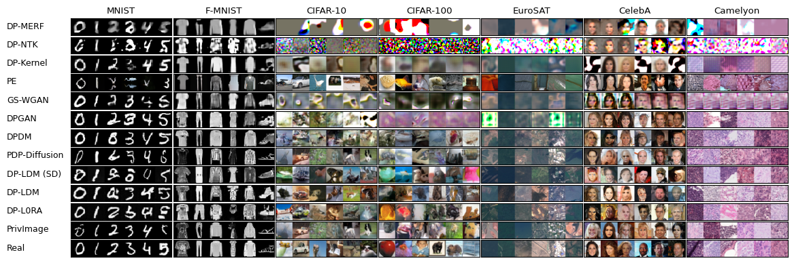

<div align=center>
  
# DPImageBench: A Unified Benchmark for Differentially Private Image Synthesis Algorithms
</div>

DPImageBench is an open-source toolkit developed to facilitate the research and application of DP image synthesis. DPImageBench simplifies the access, understanding, and assessment of DP image synthesis, making it accessible to both researchers and the broader community.

<div align=center>

</div>

<p align="center">Synthetic images by algorithms in DPImageBench with $\epsilon=10$ .</p>

## 1. Contents
  - [1. Contents](#1-contents)
  - [2. Introduction](#2-introduction)
    - [2.1 Currently Supported Algorithms](#21-currently-supported-algorithms)
  - [3. Repo Contents](#3-repo-contents)
  - [4. Quick Start](#4-quick-start)
    - [3.1 Installation](#31-installation)
    - [3.2 Dataset and Files Preparation](#32-dataset-and-files-preparation)
    - [3.3 Training](#33-training)
    - [3.4 Inference](#34-inference)
  - [4. Contacts](#4-contacts)
  - [5. Acknowledgment](#5-acknowledgment)

### Updates 
- 🎉 **(2024.11.19)** We're thrilled to announce the release of initial version of DPImageBench!

### Todo
- [ ] recoding the intermediate results of methods with tqdm.

- [ ] setup.master_port=6026

- [ ] keep consistent cond and uncond for dm and gan

- [ ] GSWGAN merge

- [ ] use a bash to represent installation.

- [ ] End to end implementation for PrivImage

- [ ] remove the unneccessary part for algorithms in models

- [ ] validation set

- [ ] models/dpsda.py -> pe?

- [ ] using 'val' as the default setting but use 'sen' to represent the original evaluation method, it seems like using 'sen' as the default setting now.

- [ ] End to end implementation of data preparation. There two problems (1) lack of downloading for places365; (2) it seems like should run preprocess_dataset.py based on the sensitive dataset one by one. Can we just use one instruction?

## 2. Introduction

### 2.1 Currently Supported Algorithms

We list currently supported DP image synthesis methods as follows.

  | Methods |  Link                                                         |
  | -------------- | ------------------------------------------------------------ |
  | DP-MERF            |  [\[AISTATS 2021\] DP-MERF: Differentially Private Mean Embeddings With Randomfeatures for Practical Privacy-Preserving Data Generation](https://proceedings.mlr.press/v130/harder21a.html) |
  | DP-NTK            |  [\[AISTATS 2021\] Differentially Private Neural Tangent Kernels (DP-NTK) for Privacy-Preserving Data Generation](https://arxiv.org/html/2303.01687v2) |
  | DP-Kernel        |  [\[NeuriPS 2023\] Functional Renyi Differential Privacy for Generative Modeling](https://proceedings.neurips.cc/paper_files/paper/2023/hash/2f9ee101e35b890d9eae79ee27bcd69a-Abstract-Conference.html) |
  | PE          |  [\[ICLR 2024\] Differentially Private Synthetic Data via Foundation Model {API}s 1: Images](https://openreview.net/forum?id=YEhQs8POIo) |
  | GS-WGAN            |  [\[NeuriPS 2020\] GS-WGAN: A Gradient-Sanitized Approach for Learning Differentially Private Generators](https://arxiv.org/pdf/2006.08265) |
  | DP-GAN            |  [\[1802.06739\] Differentially Private Generative Adversarial Network (arxiv.org)](https://arxiv.org/abs/1802.06739) |
  | DPDM          |  [\[TMLR 2023\] Differentially Private Diffusion Models](https://openreview.net/forum?id=ZPpQk7FJXF) |
  | PDP-Diffusion       | [\[2302.13861\] Differentially Private Diffusion Models Generate Useful Synthetic Images (arxiv.org)](https://arxiv.org/abs/2305.15759) |
  | DP-LDM            | [\[TMLR 2024\] Differentially Private Latent Diffusion Models (arxiv.org)](https://arxiv.org/abs/2302.13861)            |
  | PrivImage       | [\[UESNIX Security 2024\] PrivImage: Differentially Private Synthetic Image Generation using Diffusion Models with Semantic-Aware Pretraining](https://www.usenix.org/conference/usenixsecurity24/presentation/li-kecen) |

### 2.2 Currently Supported Datasets
We list the studied datasets as follows, which include seven sensitive datasets and two public datasets.
  | Dataset | Usage   |
  | ------- | --------------------- |
  | ImageNet_ILSVRC2012             |  Pretraining dataset  |
  | Places365             |  Pretraining dataset  |
  | MNIST             |  Sensitive dataset  |
  | FashionMNIST             |  Sensitive dataset  |
  | CIFAR-10                   |  Sensitive dataset  |      
  | CIFAR-100                   |  Sensitive dataset  |      
  | EuroSAT             |  Sensitive dataset  |
  | CelebA             |  Sensitive dataset  |
  | Camelyon                   |  Sensitive dataset  |                                     |

## 3. Repo Contents

Below is the directory structure of the DPImageBench project, which organizes its two core functionalities within the `models/` and `evaluation/` directories. To enhance user understanding and showcase the toolkit's ease of use, we offer a variety of example scripts located in the `scripts/` directory.


```plaintext
DPImageBench/
├── config/                     # Configuration files for various DP image synthesis algorithms
│   ├── DP-MERF      
│   ├── DP-NTK       
│   ├── DP-Kernel
│   ├── PE            
│   ├── DP-GAN         
│   ├── DPDM        
│   ├── PDP-Diffusion      
│   ├── DP-LDM   
│   ├── GS-WGAN
│   └── PDP-Diffusion   
├── data/                       # Data Preparation for Our Benchmark
│   ├── stylegan3
│   ├── SpecificPlaces365.py
│   ├── dataset_loader.py
│   └── preprocess_dataset.py 
├── dataset/                    # Datasets studied in the project
├── dnnlib/ 
├── docker/                     # Docker file
├── exp/                        # The output of the training process and evaluation results.
├── evaluation/                 # Evaluation module of DPImageBench, including utility and fidelity
│   ├── classifier/             # Downstream tasks classification training algorithms
│   │   ├── densenet.py  
│   │   ├── resnet.py 
│   │   ├── resnext.py 
│   │   └── wrn.py 
│   ├── ema.py 
│   └── evaluator.py 
├── models/                     # Implementation framework for DP image synthesis algorithms
│   ├── DP_Diffusion      
│   ├── DP_GAN       
│   ├── DP_MERF
│   ├── DP_NTK          
│   ├── GS_WGAN       
│   ├── PE     
│   ├── PrivImage
│   ├── dpsgd_diffusion.py
│   ├── dpsgd_gan.py
│   ├── pretrained_models       # The pre-downloaed files for PE and PrivImage
│   ├── model_loader.py           
│   └── synthesizer.py  
├── opacus/                     # Implementation of DPSGD
├── plot/                       # Figures and plots in our paper
│   ├── plot_eps_change.py                           # Plotting for Figure 5 and 10
│   ├── plot_size_change.py                          # Plotting for Figure 6
│   ├── plot_wo_pretrain_cond_cifar10.py             # Plotting for Figure 7
│   ├── plot_wo_pretrain_cond_fmnist.py              # Plotting for Figure 9
│   ├── plot_wo_pretrain_places_imagenet.py          # Plotting for Figure 4   
│   └── visualization.py   
├── scripts/                    # Scripts for using DPImageBench
│   ├── diffusion_size_change.py                    
│   ├── download_dataset.sh                          
│   ├── eps_change.sh.                               
│   ├── gan_size_change.sh                           
│   ├── pdp_diffusion.sh                             
│   └── test_classifier.py                           
├── torch_utils/                # Helper classes and functions supporting various operations
│   └── persistence.py                     
├── utils/                      # Helper classes and functions supporting various operations
│   └── utils.py                     
├── README.md                   # Main project documentation
└── requirements.txt            # Dependencies required for the project
```

## 4. Quick Start

### 4.1 Install DPImageBench

Clone repo and setup the environment:

 ```
git clone git@github.com:2019ChenGong/DPImageBench.git
conda create -n dpimagebench python=3.7
conda activate dpimagebench
pip install torch==1.12.1+cu116 torchvision==0.13.1+cu116 torchaudio==0.12.1 --extra-index-url https://download.pytorch.org/whl/cu116
pip install tensorflow-gpu==1.14.0
pip install requirements.txt
cd opacus; pip install -e .; cd ..
cd models/PE/improved-diffusion; pip install -e .; cd ..; cd ..; cd ..
cd models; gdown https://drive.google.com/uc?id=1yVTWzaSqJVDJy8CsZKtqDoBNeM6154D4; unzip pretrained_models.zip; cd ..
 ```

### 4.2 Prepare Dataset

 ```
mkdir dataset
sh scripts/download_dataset.sh
python preprocess_dataset.py; cd ..
 ```

 After running, we can found the folder `dataset`:

  ```plaintext
dataset/                                  
├── camelyon/       
├── celeba/ 
├── cifar10/ 
...
```

### 4.3 Running

 ```
conda activate dpimagebench
cd DPImageBench
python run.py --config configs/{model_name}/{dataset_name}_eps{epsilon}.yaml
 ```

Available `model_name` are [`DP-NTK`, `DP-Kernel`, `DP-LDM`, `DP-MERF`, `DP-Promise`, `DPDM`, `PE`, `G-PATE`, `PDP-Diffusion`, `PrivImage`].

Available `epsilon` is [`1.0`].

Available `dataset_name` is [`mnist_28`].


### 4.4 Results Checking

## Acknowledgement
 
